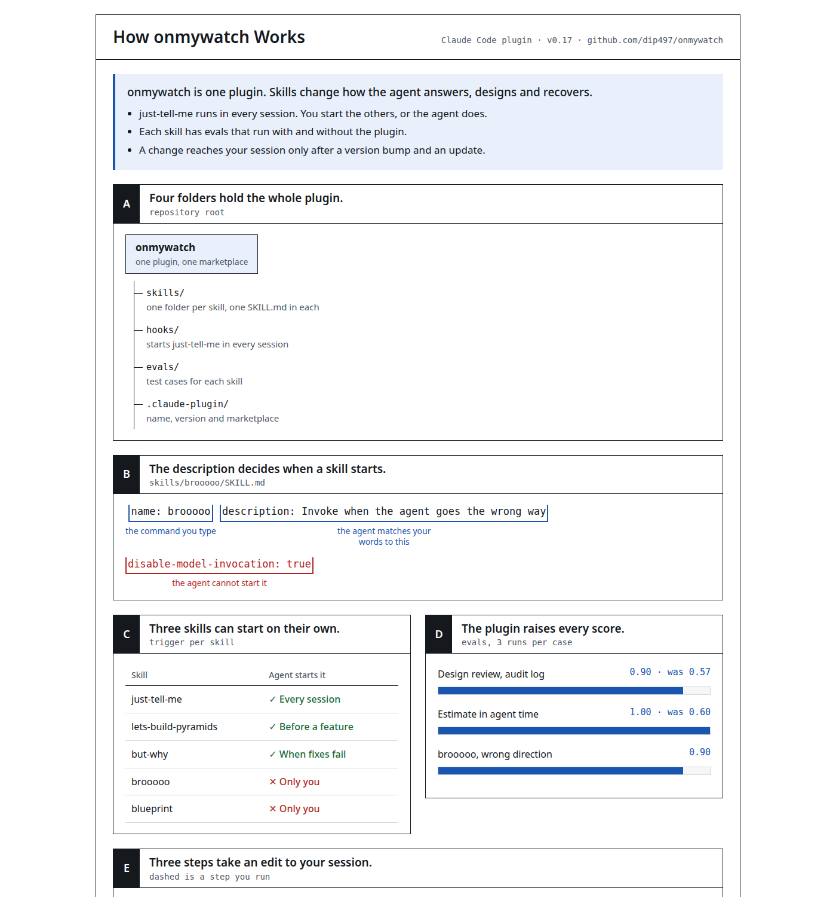

# onmywatch

A small stack of skills for Claude Code that makes coding agents answer straight, think before they build, and own their mistakes.

"Not on my watch": nothing half-designed, unverified or buried in filler gets past.

## Install

Inside Claude Code:

```
/plugin marketplace add dip497/onmywatch
/plugin install onmywatch@onmywatch
```

Or from a terminal:

```
claude plugin marketplace add dip497/onmywatch
claude plugin install onmywatch@onmywatch
```

Restart Claude Code after installing. To update later:

```
claude plugin marketplace update onmywatch
claude plugin update onmywatch@onmywatch
```

## Skills

| Skill | What it does | How it starts |
|---|---|---|
| `/onmywatch` | Entry point. Reads the task and picks the skills below that apply. | You or the agent |
| `/just-tell-me` | Replies lead with the answer, number the steps, say where the work stands and end with one next step. No filler. | On in every session |
| `/lets-build-pyramids` | Architecture review before a feature is built: researches how others solved it, looks at it from six views, compares three real designs at today's size, 10x and 100x, and runs a pre-mortem. | You or the agent |
| `/but-why` | First-principles redesign: separates facts from inherited choices and habits, then rebuilds the design from the facts. | You or the agent |
| `/brooooo` | Press it when a reply did not land or the agent got something wrong. It restates plainly, or owns the mistake and fixes it. | You |
| `/blueprint` | Shows the topic instead of explaining it: a text picture or Mermaid in the chat, or an HTML engineering sheet (`/blueprint sheet`, `/blueprint share`). | You |
| `/no-added-comments` | Keeps diffs free of comments the agent added. | You or the agent |

"You or the agent" means you can type it, and the agent also starts it on its own when the task matches.

### Turning just-tell-me off

- For one session: say "stop just-tell-me".
- For good: fork the repo and delete `hooks/`.

### blueprint sheet



## Evals

Each skill with evals has a folder under `evals/<skill>/<case>/`. A case is either `prompt.md` plus `graders/*.md`, or a `case.yaml` when it needs an earlier conversation (`history.jsonl`) or starting files (`scaffold.sh`). Write the conversation as `history.md` with `## User` and `## Assistant` sections, then convert it:

```
python3 evals/history.py evals/<skill>/<case>/history.md
```

Run one skill's cases:

```
claude plugin eval . --tag lets-build-pyramids --runs 3 --allow-tools WebSearch WebFetch
claude plugin eval . --tag just-tell-me --runs 3 --judge-model sonnet
claude plugin eval . --tag brooooo --runs 3 --scaffold --allow-tools Edit Write --judge-model sonnet
```

Latest scores, 3 runs per case:

| Skill | Case | With plugin | Without |
|---|---|---|---|
| `lets-build-pyramids` | Audit log for a multi-tenant SaaS | 0.90 | 0.57 |
| `lets-build-pyramids` | Daily digest email for 50k users | 1.00 | 0.67 |
| `brooooo` | Agent did the opposite of what was asked | 0.90 | n/a |
| `brooooo` | Agent claimed a test passed without running it | 0.83 | n/a |
| `brooooo` | Reply full of jargon | 0.73 | n/a |
| `just-tell-me` | Estimate for a feature, sized in agent time | 1.00 | 0.60 |
| `just-tell-me` | Explain a bug and its fix (about 30% fewer words) | 1.00 | 1.00 |
| `just-tell-me` | Unsafe command question, keeps the "no" | 1.00 | 1.00 |

`brooooo` has no "without" score: it is a command you type, so it does not exist without the plugin.

## Adding a skill

1. Create `skills/<name>/SKILL.md` with `name` and `description` frontmatter.
2. Add a row to the table above and to `skills/onmywatch/SKILL.md`.
3. Add eval cases under `evals/<name>/<case>/` and tag them with the skill name.
4. Bump `version` in `.claude-plugin/plugin.json`.

## Credits

- `just-tell-me` adapts [i-have-adhd](https://github.com/ayghri/i-have-adhd) by Ayoub Ghriss (MIT), with lessons from [caveman](https://github.com/JuliusBrussee/caveman) by Julius Brussee and [caveman-micro](https://github.com/kuba-guzik/caveman-micro).
- `brooooo` adapts `bro`, and `but-why` adapts `principle-redesign-from-first-principles` and `principle-attack-the-premise`, from [pstack](https://github.com/cursor/plugins/tree/main/pstack) by Lauren Tan (MIT).
- `blueprint` draws on [show-me](https://github.com/humanlayer/skills/tree/main/plugins/show-me) by HumanLayer (MIT), the [html-plan](https://github.com/anthropics/claude-plugins-community/tree/main/html-plan) plugin by Thariq Shihipar (MIT), [archify](https://github.com/tt-a1i/archify) by tt-a1i (MIT), Claude's artifact design and diagramming guidance, and Andrej Karpathy's note on asking for STE text, diagrams and HTML instead of prose.

## License

[MIT](LICENSE)
